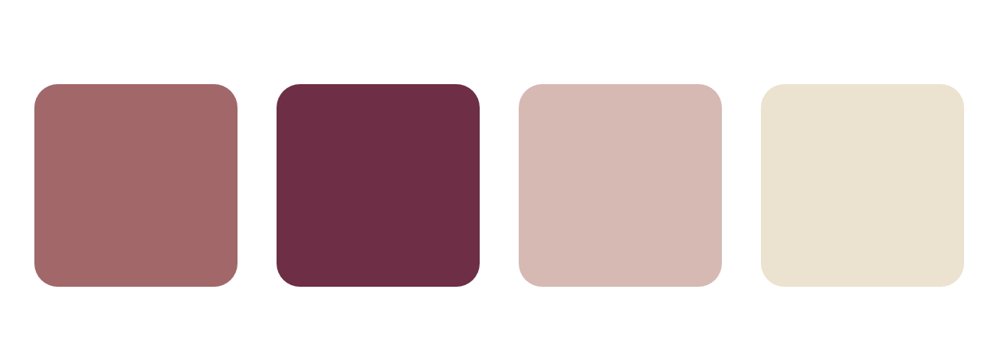

# ネイルサロンのサンプルサイトを制作しました

## サイトについて
よく使えるアニメーション表現をご紹介するためにサンプルサイトを作成しました。

ターゲット：30~50代の女性。自分にご褒美として、リラックスした空間でネイルケアをしたい方。

※トップページのみで詳細ページは作成していません。

## デザイン
大人の女性に合うエレガントな色をチョイスしました。

## アニメーション

各所にアニメーションを取り入れて、ゆったりとした雰囲気を演出しています。

* ローディング画面
* タイトルが左から流れるように表示
* スクロールで背景画像が拡大
* 花の横の文章をふわっと表示
* マウスオーバーで写真拡大
* ふわっと色が変わるボタン
* 左から流れるように見出しを表示
* newsの横のスライドショー
* ハンバーガーメニュー：右上から円が広がるように表示
* ハンバーガーメニュー：光りながらタイトル表示
