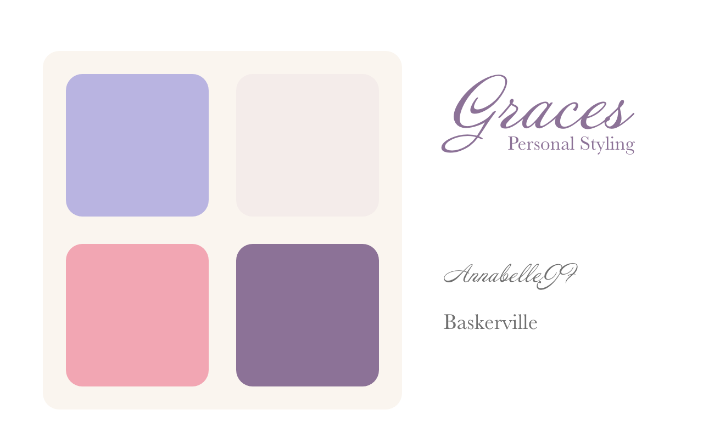

# Snow Monkeyのサンプルサイトを制作しました
## 制作背景
架空のパーソナルスタイリストのホームページを制作しました。

このサンプルサイトで、WordPressの有料テーマ「Snow Monkey」の機能で、どんなレイアウト・デザインが作れるのかご紹介しています。

## デザインについて

紫を基調に大人の女性向けのエレガントな雰囲気を表現しています。

## 技術的な対応について

ブロックを利用して、ページを作成しているので、文章や画像の差し替えは自由に行えます。

Snow Monkey標準のスタイルに加えて、デザインのオリジナリティをだすために、独自プラグイン内でCSS設定を加えています。

* Googleフォントの読み込み
* スクロール時の固定ヘッダーを透明にする
* ページ下のCTA(お問い合わせ)に背景
* フッターのメニュー、SNSアイコン、購読ボタン
