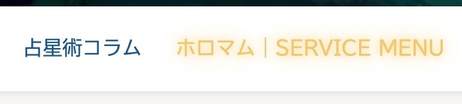

## サイトについて
Horoscope Heart & Momstrologyのホームページ作成をお手伝いさせていただきました。

占星術を感性で読み、ひとりひとりの特別な使命にたどり着くための方法論を伝えていらっしゃいます。

サーバー・ドメインの設定、WordPressセットアップなど技術的なサポートと、操作レクチャーをさせていただきました。

WordPressははじめてといいつつ、いつのまにか使い方をマスターし、光速でコンテンツを作り上げていらっしゃいました。

ちょっとした遊び心として、マウスオーバーをすると星の光のようにふわっと輝くようにしています。

## 運営者Junさんの魅力

* 抽象的な概念×現実的な思考・行動、どちらの視点も自由に行き来できるところ
* ものごとの動きを観察して、的確な言葉で伝えてくれるところ
* 人の素質や魅力を見抜いて、その人以上に信じて応援してくれるところ

ふわっと捉えどころのなかった占星術の世界が腑に落ちる。

星読みの視点から、人生の物語を紐といて。 
自分の原点に立ち返って、前に進むパワーをもらえるセッションが評判です。

私も一度受けさせていただきましたが、濃くって楽しい時間でした。

## 知恵を授かる、図書館のような場所。

2017年に立ち上げて以降、どんどんコンテンツが深く充実していらっしゃいます。

私の印象では、占星術、フラワーレメディ、哲学、、、など、いろんな蔵書が詰まった図書館のイメージがあります。

一角に、面白そうな本を見つけたり。 
たまたま開いたページに、前に進むヒントをもらったり。 
懐かしい本をもう一度読んで、感じ方の変化に気づいたり。

訪れる人の知恵が深まっていく場所です。

どうぞ、ご覧になってくださいね。
