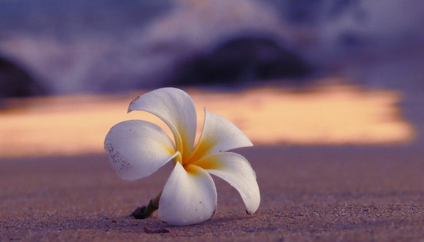
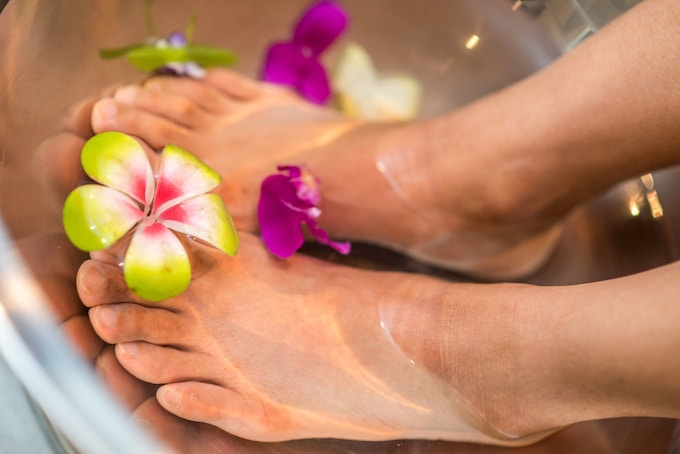

# PualeiさまのHPをリニューアルさせていただきました

現在運営中のホームページについて、お困りごとやご要望をお伺いしました。 
ご自身でも簡単に運営できるよう、WordPressを使ってリニューアルすることになりました。

今回のリニューアルと合わせて、サーバーとドメイン管理会社も変更することになりました。 
公開中のホームページに影響がでないよう、別環境でホームページを作成し、完成した段階で新しいホームページへの切り替えを行っています。

## デザインについて

ハワイの空気を感じてもらえるよう、アイコンはプアレイの花。

メインカラーは「マゼンダピンク」。 
マゼンダピンクは愛の色とも呼ばれています。 
Pualeiの持ち味である確かな腕と、慈しむような愛にもぴったり。

「ここのピンクはもうちょっと濃い方がいい？」 
「このピンクには、薄めの黄色をあわせてみたらどうか？」

打ち合わせの中では、複数の配色を実際に設定して、調整していきました。

テーマは、デザインと機能の観点から、オススメできるテーマの候補をご提案し、その中から選んでいただきました。
トップページのレイアウトやお問い合わせフォームなど、テーマの標準機能では足りない部分はカスタマイズしています。

## 操作レクチャーから、ご自身でコンテンツを制作

WordPressの使い方レクチャーから、コンテンツ作りにチャレンジしてくださいました。

今回のホームページは、写真や文章などのコンテンツは全てご本人が作成しています。

実際に操作していると、さまざまな疑問がでてくるもの。

「なぜか不自然な改行が空いてしまう…」 
「アイキャッチってどうやって作る？」 
「ここに動画を載せるにはどうしたらいい？」 
「Line＠のお友達登録ボタンを追加したい」などなど、 

毎回のミーティングで疑問点を解消し、完成時にはWordPressをすっかり習熟されていました。

## いただいたご感想

ご感想をいただきましたので、掲載させていただきます。

最初はパソコン音痴の私にできるか不安でしたが、とても丁寧な指導でわかりやすかったです。 
仕事と家事で毎日忙しかったので、ZOOMで受講できたのはとても助かりました。 
HPを作っていくと、ここをもっとこんな感じしたいっていう要望がたくさん出てきたのですが、それに対してもしっかりやり方を教えていただけました。 
細かい要望や、前に聞いて忘れてしまった事も、優しく教えてくださいます。 
素人目線でこうしたら変かなぁ？と迷ったりする部分も、いろいろアドバイスもいただけました。 
私の好みを把握してくださり、いろいろ提案もしていただき、助かりました。 
プロじゃないと難しい作業については、要望に合わせてカスタマイズしていただきました。 
そして、私好みの素敵なHPができあがり、とっても嬉しいです！ 
新しいHPは周りからの評判がとても良いです。 
ありがとうございました＾＾ 

## ハワイアンヒーリングサロンPualeiはこんな方にオススメです

* 癒されたい方
* 頑張り屋さんで疲労を感じている方
* 体だけでなく心からリラックスしたい方
* 本物のロミロミを体験したい方

ご興味のある方はぜひ、ハワイアンヒーリングサロンのハッピーな世界にふれてみてくださいね。
